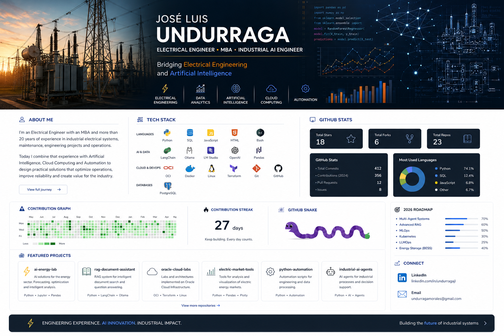

  

# ⚡ Industrial AI Engineer

### *Where Engineering Meets Artificial Intelligence*

**Electrical Engineer • MBA • 20+ Years of Engineering Experience**

 

<table>
<tr>

<td width="50%" valign="top">

## 👨 EXPERIENCE

- ⚡ Medium Voltage Systems
- 🏭 Industrial Power Distribution
- 🔧 Industrial Maintenance
- 📐 Engineering Projects
- 📊 Data Analytics
- 📈 Process Optimization
- ⚙️ Operations Management

</td>

<td width="50%" valign="top">

## 🎯 CURRENT MISSION

Design intelligent solutions for industrial environments by combining:

- 🤖 Artificial Intelligence
- 📊 Data Analytics
- ☁️ Cloud Computing
- 🔄 Automation
- 🧠 Large Language Models
- ⚡ Engineering Expertise

</td>

</tr>
</table>

---

# 🧪 Industrial AI Laboratory

<table>

<tr>

<td width="50%" valign="top">

## 🧠 AI Agents

Autonomous agents for industrial automation, engineering support and decision-making.

**Status:** 🟡 Building

</td>

<td width="50%" valign="top">

## 📚 Intelligent Documents

RAG solutions for technical documentation, procedures and engineering knowledge.

**Status:** 🟡 Building

</td>

</tr>

<tr>

<td width="50%" valign="top">

## ⚡ Power Systems

Tools for medium-voltage engineering, industrial distribution, maintenance and electrical analysis.

**Status:** 🟢 Active

</td>

<td width="50%" valign="top">

## 📊 Data Analytics

Python applications for KPI reporting, operational dashboards and engineering insights.

**Status:** 🟢 Active

</td>

</tr>

<tr>

<td width="50%" valign="top">

## ☁️ Cloud Infrastructure

Oracle Cloud Infrastructure, Docker, Terraform and Linux environments.

**Status:** 🟡 Building

</td>

<td width="50%" valign="top">

## 🔋 Energy Systems

Research and AI applications for BESS, photovoltaic systems and electricity markets.

**Status:** 🔵 Research

</td>

</tr>

</table>

---

---

# 🚀 Currently Building

<table>
<tr>

<td width="50%" valign="top">

### 🤖 Artificial Intelligence

- AI for Industrial Engineering
- Intelligent Document Processing
- AI Agents
- Industrial Automation Tools

</td>

<td width="50%" valign="top">

### ☁️ Cloud & Data

- Oracle Cloud Labs
- Data Analytics Projects
- Infrastructure Automation
- Engineering Workflows

</td>

</tr>
</table>

---

# 💡 Engineering Philosophy

> **Technology creates value only when it solves real industrial problems.**
>
> *My goal is to combine engineering expertise, data analytics and artificial intelligence to build practical solutions for industry.*

---

# 🤝 Let's Connect

  

